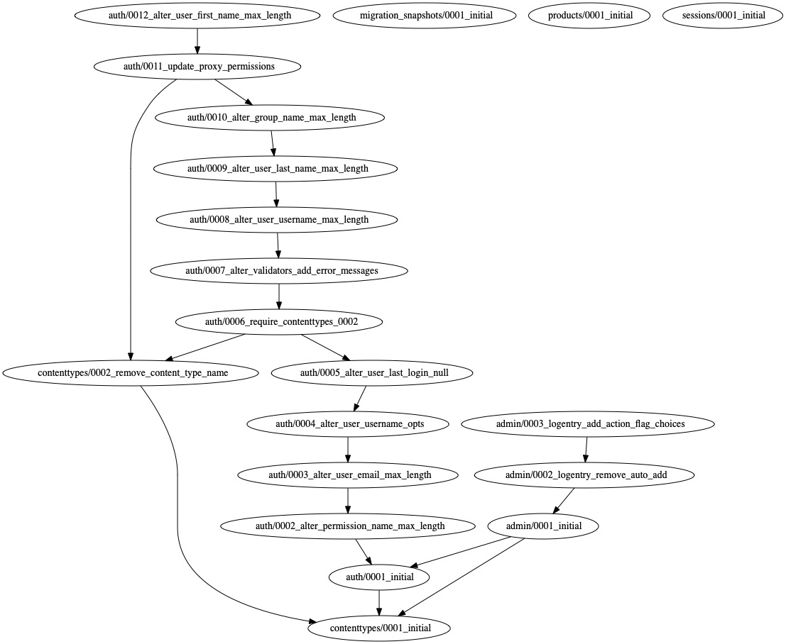

=============================
Django Migration Snapshots
=============================

.. image:: https://img.shields.io/badge/license-BSD-blue.svg
   :target: https://github.com/Lenders-Cooperative/django-migration-snapshots/blob/main/LICENSE

.. image:: https://readthedocs.org/projects/django-migration-snapshots/badge/?version=stable&style=flat
   :target: https://django-migration-snapshots.readthedocs.io

.. image:: https://img.shields.io/pypi/v/django-migration-snapshots.svg
   :target: https://pypi.org/project/django-migration-snapshots/

.. image:: https://img.shields.io/pypi/pyversions/django-migration-snapshots
   :target: https://pypi.org/project/django-migration-snapshots/

.. image:: https://img.shields.io/badge/code%20style-black-000000.svg
   :target: https://github.com/psf/black

Capture snapshots of your django project's migration history. These snapshots are represented as a directed graph using ``pygraphviz`` in both textual and graphical formats.

Documentation
-------------

The full documentation is at https://django-migration-snapshots.readthedocs.io.

Quickstart
----------

Install Django Migration Snapshots::

    pip install django-migration-snapshots

Add it to your ``INSTALLED_APPS``:

.. code-block:: python

    INSTALLED_APPS = (
        ...
        "migration_snapshots",
        ...
    )

1) Execute management command to create snapshot
^^^^^^^^^^^^^^^^^^^^^^^^^^^^^^^^^^^^^^^^^^^^^^^^
.. code-block:: python

    # creates snapshot of entire migration history
    python manage.py create_snapshot

    # filter migrations before applied date (YYYY-MM-DD)
    python manage.py create_snapshot --date="2022-10-15"

2) Create object programmatically or from the admin panel
^^^^^^^^^^^^^^^^^^^^^^^^^^^^^^^^^^^^^^^^^^^^^^^^^^^^^^^^^
.. code-block:: python

    MigrationSnapshot.objects.create(output_format="pdf")

3) Automatically create migration snapshots with the `post_migrate` signal
^^^^^^^^^^^^^^^^^^^^^^^^^^^^^^^^^^^^^^^^^^^^^^^^^^^^^^^^^^^^^^^^^^^^^^^^^^^^
.. code-block:: python

    from django.apps import AppConfig
    from django.db.models.signals import post_migrate

    def my_snapshot_callback(sender, **kwargs):
        # Create migration snapshot
        MigrationSnapshot.objects.create(output_format="pdf")

    class MyAppConfig(AppConfig):
        ...

        def ready(self):
            # send signal only once after all migrations execute
            post_migrate.connect(my_snapshot_callback, sender=self)

Text Snapshot
-------------

.. code-block:: python

    digraph {
        "admin/0001_initial" -> "auth/0001_initial"
        "admin/0001_initial" -> "contenttypes/0001_initial"
        "admin/0002_logentry_remove_auto_add" -> "admin/0001_initial"
        "admin/0003_logentry_add_action_flag_choices" -> "admin/0002_logentry_remove_auto_add"
        "auth/0001_initial" -> "contenttypes/0001_initial"
        "auth/0002_alter_permission_name_max_length" -> "auth/0001_initial"
        ...
    }

Graphical Snapshot
------------------

Features
--------
* ``MigrationSnapshot`` data model
* Supported output formats

  * *BMP, CGIMAGE, DOT_CANON, DOT, GV, XDOT, XDOT12, XDOT14, EPS, EXR, FIG, GD, GIF, GTK, ICO, CMAP, ISMAP, IMAP, CMAPX, IMAGE_NP, CMAPX_NP, JPG, JPEG, JPE, JPEG_2000, JSON, JSON0, DOT_JSON, XDOT_JSON, PDF, PIC, PICT, APPLE_PICT, PLAIN_TEXT, PLAIN_EXT, PNG, POV_RAY, PS_PDF, PSD, SGI, SVG, SVGZ, TGA, TIF, TIFF, TK, VML, VMLZ, VRML, WBMP, WEBP, XLIB, X11*
* View migration history based on the miigration's applied timestamp

TODO's
-------
* Additional test coverage
* Setup tox
* Additional filters in management command (ie; per app, per model, etc.)

Local Development
-----------------

::

    make install
    make test

Deployment
----------

::

    make build
    make deploy

License
-------

This project is provided under the `BSD License <https://github.com/theognis1002/django-migration-snapshots/blob/main/LICENSE>`_.

